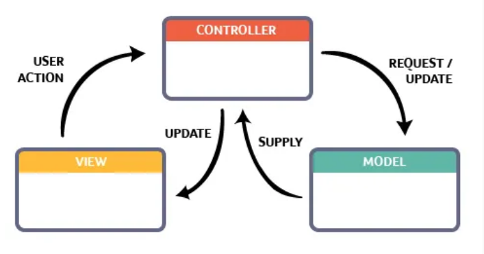
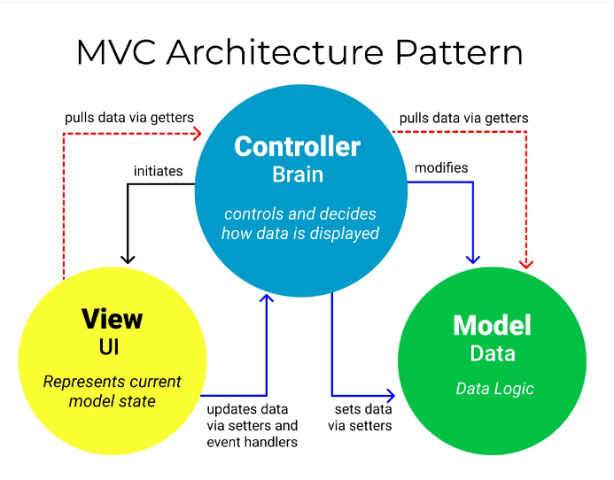
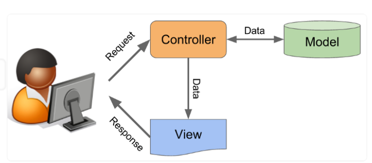

# MÔ HÌNH MVC 

## Mô hình MVC là gì?
- Mẫu kiến trúc phần mềm tạo lập giao diện người dùng
- Model (dữ liệu), View (giao diện) và Controller (bộ điều khiển)
- Mỗi phần đảm nhận vai trò riêng biệt và độc lập
  

## Thành phần trong mô hình MVC?

Có 3 thành phần chính:

- **Model**: lưu trữ toàn bộ dữ liệu của ứng dụng và là cầu nối giữa **View** và **Controller**. **Model** có thể là cơ sở dữ liệu, file XML bình thường hoặc một đối tượng đơn giản (biểu tượng hoặc nhân vật game).
- **View**: giao diện người dùng, hiển thị các đối tượng trong một ứng dụng.
- **Controller**: xử lý các yêu cầu từ người dùng đưa đến thông qua **View**. Nó bao gồm **Model** lẫn **View**, nó nhận input và thực hiện các update tương ứng.

## Luồng xử lý trong MVC

**B1:** Khi 1 yêu cầu từ client gửi đến server, **Controller** chặn lại để xem đó là URL request hay event.

**B2:** **Controller** xử lý input của user rồi giao tiếp với **Model**.

**B3:** **Model** chuẩn bị data gửi lại cho **Controller**

**B4:** Khi xử lý yêu cầu xong thì **Controller** gửi dữ liệu trở lại **View** và hiển thị cho người dùng.

**View** không giao tiếp trực tiếp với **Model**, sự tương tác giữa View và Model thông qua Controller.

## Ưu và nhược điểm của MVC
### Ưu điểm
- Băng thông (bandwwidth) nhẹ, web hoạt động ổn định hơn
- Kiếm tra đơn giản và dễ dàng
- Tách biệt các thành phần với nhau
- Sử dụng trên các ngôn ngữ khác nhau
- Có thể làm việc theo team nhiều developer
- Hỗ trợ TTD (test-driven development) với unit test
### Nhược điểm
- Phù hợp với công ty chuyên về website, dự án lớn
- Khó triển khai

## Reference: [Vietnix.vn - Tìm hiểu mô hình MVC là gì? Ví dụ về cách sử dụng mô hình MVC](https://vietnix.vn/tim-hieu-mo-hinh-mvc-la-gi/)

